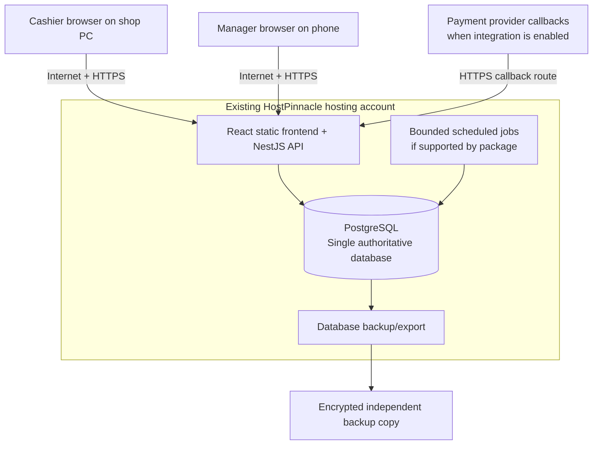

# Pay & Go POS — Architecture and Delivery Plan

**Status:** Local development active; HostPinnacle deployment verification deferred

**Version:** 0.7

**Last updated:** 21 September 2026

**Budget objective:** Zero application licence fees and no additional hosting subscription for the first test shop, within the existing HostPinnacle package. Existing hosting/domain renewals still apply.

**Working assumptions:** One shop in Kenya, one cashier computer initially, one manager using a phone. Confirm these during discovery.

**Current machine (16 September 2026):** PostgreSQL 18 is installed and running. Development migrations, isolated integration tests and local manager/cashier password login pass. SMTP, full interactive browser verification and HostPinnacle deployment remain separate gates.

## 1. Purpose and revision

This is the development reference for Pay & Go. Version 0.7 records the locally verified authentication/catalogue foundation and payment-to-shift cash reconciliation while retaining the user's existing HostPinnacle hosting target. The user has confirmed that PostgreSQL and a Node.js application management feature are listed in the hosting panel.

Working conventions are defined in [project rules](../AGENTS.md), with scoped [frontend rules](../frontend/AGENTS.md) and [backend rules](../backend/AGENTS.md). Read the [current handoff](HANDOFF.md) for actual implementation and verification status. A planned feature is not an implemented feature.

The initial deployment is an online web application: React/Vite frontend, NestJS backend, and one authoritative PostgreSQL database on HostPinnacle. Cashiers and managers use different screens in the same application through HTTPS.

Listing the features establishes a deployment candidate, not a tested hosted runtime. HostPinnacle Node.js/PostgreSQL versions, application startup, database connectivity, limits, scheduled jobs and backups must be verified through a small deployment test before the hosted pilot. At the user's direction, local development proceeds while deployment troubleshooting remains deferred.

The previous local-PC hosting and phone VPN proposal is superseded for this online pilot. A local store service and synchronization remain a future option if checkout must survive internet outages. No Vercel subscription, VPN client, Redis or desktop wrapper is required for the proposed starting deployment.

“Free start” means reusing hosting already paid for and using free application technologies. It does not remove hosting renewal, development, internet, hardware, payment or integration costs. Offline checkout is outside the initial hosted test scope; its priority for live trading remains an explicit decision.

## 2. What we build first

Build a modular monolith: one backend with clearly separated business modules and one responsive frontend.

- Cashier: fast barcode checkout, basket, cash payment, receipt, and shift closing.
- Manager: phone dashboard, sales, stock, cashier activity, and exceptions.
- Stock: product import, opening stock, receiving, adjustments, returns, and stocktake.
- Controls: permissions, approval limits, audit records, duplicate-request protection, and tested backups.
- Integrations: simulation first; actual payment and fiscal workflows before live use as applicable.

Quality is measured by correct transactions, quick checkout, clear screens, successful recovery, and understandable reports. More infrastructure is not itself a quality target.

## 3. Architecture for the test shop

### 3.1 How this works

1. Develop and test locally against a separate development PostgreSQL database.
2. Compile the React frontend and NestJS backend before deployment.
3. Register the compiled Node.js application with the hosting panel's application manager. Prove the supported startup method and restart behavior.
4. Prefer one application origin, for example `https://pos.<owned-domain>/`, with the API under `/api`. NestJS can serve the compiled frontend files alongside its API. The actual domain is still to be selected.
5. Connect the API to a dedicated PostgreSQL database/user using server-side configuration and the provider's required connection settings.
6. The cashier and manager sign into the same HTTPS application. The manager needs only a browser and internet access; the shop PC can be off.
7. Store backups independently of the hosting account.

There is one database, with no store/cloud synchronization in this stage. Browser code never connects directly to PostgreSQL or contains database credentials.

If the hosting account requires separate frontend/API origins, use owned subdomains, explicit CORS allowlists, and tested session/cookie behavior. Prefer the single-origin deployment to simplify authentication.

### 3.2 Failure behavior

| Situation | Checkout | Manager on a separate working internet connection |
| --- | --- | --- |
| Hosting and internet working | Available | Available |
| Store internet unavailable | Cannot finalize sales | Available |
| Shop PC off or failed | That till unavailable | Available |
| Hosting API or database unavailable | Cannot finalize sales | Live reports unavailable |
| Manager phone loses connectivity | Other connected tills unaffected | Show unavailable/stale state |
| Printer fails after sale commits | Sale remains saved; reprint same receipt | Sale remains visible |
| Connection drops after submit | Outcome uncertain; query original request ID on reconnect | Committed sale remains visible |

A cached screen or unfinished basket is not an offline sales system. Never show a sale as completed without a confirmed server commit.

Before live use, decide whether internet-dependent checkout is acceptable. If it is not, the local-service/synchronization phase becomes a launch requirement rather than a later enhancement.

## 4. Free starting stack

| Purpose | Choice | Starting licence/hosting cost | Reason |
| --- | --- | --- | --- |
| Frontend | React + TypeScript + Vite | KES 0 software licence | One responsive app, built into static files |
| Backend | NestJS + TypeScript on Node.js | KES 0 software licence | Structured modules and shared language |
| Database | PostgreSQL in existing HostPinnacle account | KES 0 application licence; verify package limits | Transactions, constraints, concurrency, reporting |
| UI components and styling | Strict shadcn/ui with the existing Base UI preset, Tailwind CSS and shared theme tokens | KES 0 software licence | Consistent accessible controls for till and phone screens |
| Hosting | Existing HostPinnacle account | Target KES 0 additional subscription | Reuse paid capacity; renewal still applies |
| Authentication | Better Auth with application users and server sessions in PostgreSQL | KES 0 external authentication subscription | User-selected authentication library; POS permissions enforced by the backend |
| Jobs | PostgreSQL job records + bounded cron runner, if supported | KES 0 external queue subscription | Durable retries without assuming always-running workers |
| Receipts | HTML/CSS receipt and installed printer driver | KES 0 extra printing subscription | Validate using actual printer |
| Reports | SQL reports, charts, CSV, browser print-to-PDF | KES 0 reporting subscription | Covers initial management needs |
| Backups | PostgreSQL tools + scheduler + encrypted separate copy | KES 0 software licence; storage may cost | Recovery under our control |
| Development tools | Git, pnpm, local automated tests | KES 0 software licence | Reproducible development and validation |
| Remote access | Application URL with HTTPS | Included if supported by existing domain/package | Phone browser accesses hosted application directly |

NestJS is MIT-licensed and PostgreSQL permits use without a fee. Paying for enterprise support or managed hosting is optional and separate from using these technologies. [NestJS licence](https://github.com/nestjs/nest/blob/master/LICENSE), [PostgreSQL licence](https://www.postgresql.org/about/licence/)

Keep NestJS. Cost does not require replacing it. Use supported, compatible versions chosen at implementation and pin dependency versions.

Use Vite for the initial internal application; there is no present requirement for public search indexing or server-rendered pages. Next.js remains an option if a later public-facing application needs it.

Use the provider-managed Node.js and PostgreSQL facilities for the hosted pilot; do not assume root access or Docker support. Local development can use native installations or containers independently of the deployment target.

## 5. Phone monitoring and hosting compatibility

Persistence implementation: use the MIT-licensed `pg` driver with parameterized SQL and `node-pg-migrate` for explicit, versioned SQL migrations. No ORM or startup schema synchronization. See [backend setup](BACKEND_SETUP.md) for environment validation, TLS, bounded pools, health checks and isolated migration testing. This local foundation does not establish hosted compatibility.

### 5.1 Confirmed context and outstanding checks

The user already pays for HostPinnacle hosting and reports PostgreSQL and Node.js application management in the panel. HostPinnacle also advertises Node.js and SSL on its shared-hosting plans. These facts support trying the existing package first. [HostPinnacle shared hosting](https://www.hostpinnacle.co.ke/hosting/shared-hosting/)

Before considering the environment ready, verify:

- Exact package, currently available control panel, supported Node.js version and application startup mechanism.
- PostgreSQL version, ability to create a dedicated database/user, connection host/port and required TLS settings.
- Runtime compatibility with the NestJS version we select.
- Build/dependency-install method and availability of terminal/SSH or an equivalent deployment workflow.
- Per-account CPU, memory, process, database connection and storage limits. Do not assume advertised server RAM is dedicated application memory.
- Process recycling, idle-start latency, restart/log access and request timeouts.
- Cron availability, minimum frequency and permitted job runtime; do not assume a persistent queue worker is allowed.
- HTTPS certificate setup, domain/subdomain routing, SPA deep links and no-cache behavior for authenticated API responses.
- Backup/export tools, retention, restore access and independently downloadable backups.
- Outbound HTTPS and inbound callback routing before introducing real payment/fiscal integrations.

These are technical checks, not reasons to buy a higher package before testing. Avoid disturbing unrelated websites or databases in the hosting account.

### 5.2 Frontend location

Host the compiled React/Vite frontend on HostPinnacle with the API. No separate frontend hosting subscription is needed if the current account has sufficient capacity.

Vercel remains optional. Its Hobby plan restricts commercial use, so do not budget a supermarket POS on Hobby. A paid commercial Vercel plan would introduce another service and cross-origin configuration if the API remained on HostPinnacle. [Vercel fair-use policy](https://vercel.com/docs/limits/fair-use-guidelines)

The selected React/Vite frontend produces static files and does not need a development server in production. [Vite static deployment](https://vite.dev/guide/static-deploy.html)

### 5.3 Dashboard behavior

The manager opens the hosted URL from a phone, signs in with MFA, and views authorized reports. No custom phone app, VPN client, or shop-PC connection is required.

Poll the API every 30–60 seconds while the dashboard is visible. Show “Last updated at…” and a clear unavailable state after failed requests. Retained figures must be visibly stale. Do not cache sensitive reports indefinitely on shared phones.

Show sales, payment totals, returns, discounts, cash variance, low stock and the last successful backup. Estimated gross profit requires trustworthy cost data and is not net profit. Begin with read-only remote monitoring; enable administrative changes only with defined permissions and approval rules.

## 6. Core product modules

The following is the product roadmap. Section 12 identifies the first test release; not every feature below must ship together.

| Module | First useful capability | Expansion |
| --- | --- | --- |
| Identity | Owner/manager, cashier, stock clerk; action permissions | Additional roles, multiple branches |
| Catalogue | Products, categories, barcodes, units, prices, tax category, CSV import | Branch price lists and scheduled promotions |
| Checkout | Scan/search, quantities, basket, hold/resume, cash, receipt/reprint | Split tender, integrated payments, advanced promotions |
| Returns | Linked return, quantity limits, approval, refund record | Integrated provider refund and credit-note automation |
| Inventory | Opening stock, append-only movements, receiving, adjustments, stocktake | Transfers, batches, expiry and reorder suggestions |
| Purchasing | Suppliers and goods received | Purchase orders, partial receipts, supplier invoices/returns |
| Cash control | Opening float, cash-in/out, close, expected/count/variance | X/Z exports and expanded sign-off workflows |
| Reporting | Daily sales, cashier/payment totals, low stock, exceptions | Rich exports, trend reports, margin analysis |
| Audit | User, time, action, reason and relevant before/after values | Separate tamper-resistant storage and alerting |
| Integrations | Test adapters and clear simulated status | M-Pesa, eTIMS, accounting and messaging |

The user confirmed weight and volume sales on 15 September 2026. The implemented catalogue uses `each`, `pack`, `kg` and `l`; planned quantity steps are 1 for `each`/`pack` and 0.001 for `kg`/`l`. Checkout fractional-line rounding examples still need definition before sale-total implementation. Expiry tracking and split-payment requirements remain open.

## 7. Data and transaction rules

### 7.1 Initial entities

- Shop, branch, till, user, role, permission, session.
- Product, barcode, category, unit, tax category, product price.
- Supplier, goods receipt, receipt line.
- Stock movement, stock balance, stocktake.
- Sale, sale line, payment, payment attempt.
- Return, return line, refund.
- Cashier shift, cash movement, audit event.
- Background job and integration document when needed.

Include branch and till identifiers in transactions from the start, using one branch initially. Do not build a multi-tenant billing or subscription system for this pilot.

### 7.2 Rules that remain essential even on a free pilot

- Represent payable currency amounts as integer minor units; use exact decimal arithmetic for quantities, unit pricing, discounts, tax, and rounding.
- Snapshot description, applied price, cost basis, tax classification/rate, and discount on each sale line.
- Store UTC timestamps and use Africa/Nairobi for shop business-day reporting.
- Commit a finalized sale, cash-payment record, stock movements, and audit record atomically in PostgreSQL.
- Assign each confirmed payment to the active cashier shift. Cash payments append a linked `cash_in` movement; card and M-Pesa payments remain shift-associated but do not increase drawer cash. Closing expected cash is opening float plus cash-in movements minus cash-out movements, and variance is counted cash minus expected cash.
- For asynchronous external payments, use explicit payment attempts and reconciliation; an external provider cannot participate in the application's database transaction.
- Use unique request IDs and constraints so retries cannot create duplicate sales/payments.
- Protect stock and returns against concurrent updates. Define whether insufficient stock blocks checkout or allows a recorded supervisor override.
- A paid sale cannot be edited or deleted. Corrections create linked returns, refunds, or other approved documents.
- Print after the database commits. A print failure must not create another sale.
- Treat product price edits as versioned changes; changing a product must not alter a historical receipt.
- Derive stock from an append-only movement ledger. Cached balances must be rebuildable.
- Define a cost method with the shop before presenting profit reports; initially propose weighted-average cost with sale-time cost snapshots.
- Keep application-level audit records append-only. Privileged hosting/database access can still alter records; stronger independent tamper resistance is a later improvement.

### 7.3 Separate sale, payment, and fiscal states

Track these independently:

| Record | Example states |
| --- | --- |
| Sale | Draft, held, finalized, cancelled before completion |
| Payment attempt | Pending, confirmed, failed, unknown/reconciliation required |
| Fiscal document | Not applicable to simulation, pending, accepted, rejected |
| Return/refund | Requested, approved, completed, failed |

A simulated receipt must say “TEST — NOT A TAX INVOICE.” A pending fiscal submission must never look accepted. Fiscal timing for real sales follows the chosen valid eTIMS workflow.

## 8. Internet dependency and future offline operation

### 8.1 Online pilot behavior

Every login, stock update and sale finalization depends on the hosted API and database being reachable. Browsers may retain an unfinished basket, but cannot complete a sale independently of the server.

Use a unique request ID for each checkout. On timeout, preserve that ID and show the outcome as unknown. On reconnect, query the result or retry the same idempotent request; never create a new sale or payment merely because a response was lost.

Retain draft baskets only as convenience data, with minimal personal information. On reconnect, revalidate prices, stock, permissions and payment status before finalization. Do not use a service worker to cache success responses to mutation requests.

### 8.2 If offline checkout becomes necessary

Add a local store service and PostgreSQL database accessible by all tills on the store LAN, with hosted reporting retained on HostPinnacle or another suitable service.

This is a separate phase because it introduces two data locations and recovery/conflict handling:

1. Define which operations are locally authoritative and which configuration is centrally managed.
2. Move branch checkout writes to the local service while connected and disconnected; do not allow two independent writers to the same sale.
3. Commit sale/payment/stock changes and an outbox event in one local transaction.
4. Deliver events with retries; atomically deduplicate and apply them to the hosted reporting database.
5. Acknowledge delivery, retain checkpoints, reconcile totals and display reporting lag.
6. Design price/configuration versioning, cross-system payment confirmation and fiscal behavior before allowing offline real sales.

Preserve one authoritative writer per business operation. Do not switch between unrelated cloud and local checkouts on network failure without a tested reconciliation design.

The first online test must not be presented as having these offline capabilities. If continuity during internet outages is required for the first live shop, implement and verify this phase before launch.

## 9. Payments and eTIMS: testing versus live sales

### 9.1 Simulated shop

Start with fake cash and simulated M-Pesa/eTIMS adapters. Use isolated test records and clearly marked receipts. No live credentials, real charges, or real fiscal invoices are needed to validate the user experience.

Exercise successful, failed, duplicate, delayed, and unknown payment responses through tests. Using a sandbox does not make the production payment flow free or approved.

### 9.2 M-Pesa

Use Daraja for integration when the core checkout is stable. Confirm the shop's Till/PayBill arrangement and provider onboarding requirements at that point. [Safaricom Daraja](https://developer.safaricom.co.ke/apis)

A manual M-Pesa tender can be included in a controlled live pilot only with a defined verification procedure: authorized staff verify merchant receipt, record the reference and amount, and reconcile it. Clearly distinguish this from API-confirmed payment. A customer screenshot or typed transaction code alone is not confirmation.

Automatic payment initiation/callbacks need a stable public HTTPS callback endpoint. The hosted NestJS API can provide a dedicated callback route if HostPinnacle permits the required requests. Verify reachability, timeouts, security rules and durable callback processing before enabling real automated payments. Browser sessions must not be required for provider callbacks; validate them using the provider-supported controls and reconciliation.

Payment attempts must retain internal IDs, provider references, amount, status and relevant timestamps. Match receipt/amount to the intended sale, deduplicate callbacks, and reconcile uncertainty before retrying a charge.

### 9.3 Cards

Initially record verified transactions from the shop's existing bank terminal, if required. Pay & Go stores the reference and result, never card number, CVV or PIN. Provider fees and applicable PCI obligations depend on the actual arrangement.

### 9.4 eTIMS

KRA supplies eTIMS software for free, while third-party POS integration may incur fees. A paid integrator is therefore no longer an assumed purchase for the simulated pilot. [KRA eTIMS costs and options](https://www.kra.go.ke/helping-tax-payers/faqs/learn-about-etims)

For real customer sales, first determine whether the shop will keep an existing compliant eTIMS process alongside the pilot, use an appropriate KRA-provided solution, or integrate this POS. Have the shop/accountant and KRA or its provider confirm suitability, issuing steps, and reconciliation. Avoid generating duplicate fiscal invoices across the old and new workflows.

“Test shop” does not exempt real trading from fiscal requirements. Before replacing the existing checkout, demonstrate the agreed actual invoice and credit-note workflow. If manual handling cannot keep up with supermarket volume, integration becomes a launch dependency and a budget item.

System-to-system integration through OSCU/VSCU remains the target where needed. Select using current KRA requirements and operating conditions; do not assume an eventual offline mode permits deferred fiscal submission without verifying the applicable process.

## 10. Printing, hardware, and deployment

Reuse the shop's existing supported PC, printer/scanner and router where suitable. The computer runs the browser, not the production database or backend.

- USB barcode scanner using keyboard input where compatible.
- Existing printer or PDF output for early tests; actual 80 mm receipt printer verified before live use.
- Browser print dialog initially. Silent printing and automatic cash-drawer control require tested integration on the till computer.
- A hosted server cannot directly access the cashier's USB printer. Add a local printing bridge or Tauri wrapper only if required by throughput/hardware tests.
- Use the existing licensed operating system and supported browser.
- Keep the till awake while trading; turning it off does not stop hosted reporting.
- A UPS and backup internet connection may improve till availability but involve hardware/connectivity costs.

### 10.1 Deployment proof before the hosted pilot

Selected test URL: `https://dev.sifulabs.co.ke/` (user supplied). The panel screenshot lists Node.js 22.23.2 and Passenger startup settings. The user can upload through File Manager; the panel selects named package.json scripts with optional parameters, not arbitrary shell commands. Hosted dependency installation failed with memory-allocation errors, and a later attempt reported an application lock for `dev`. The current remote process/lock state is unknown. Troubleshooting is deferred by the user; do not rerun hosted scripts as part of local development. Local production-only wrapper/API and real PostgreSQL migration tests passed on Node 22.23.2, in addition to the original Node 24 baseline. Hosted PostgreSQL details, HTTPS routing and actual Passenger behavior remain unverified. The `app.cjs` bridge follows the [CloudLinux CommonJS wrapper for ESM](https://docs.cloudlinux.com/cloudlinuxos/cloudlinux_os_components/#limitations). Follow the [deployment runbook](HOSTPINNACLE_DEPLOYMENT.md) for the backend-only proof; frontend packaging and SPA verification follow separately.

Use an isolated test application/subdomain and test database in the existing account. Deployment requires account access provided through an appropriate secure channel when that step is reached; this document does not record credentials.

1. Select compatible Node.js/NestJS/PostgreSQL versions supported by the account.
2. Deploy a minimal compiled NestJS application with a static React page and a health endpoint that exposes no secrets.
3. Connect with a dedicated database user; apply a small migration and confirm an insert/read/rollback.
4. Set secrets using protected server-side environment/configuration; none may be embedded in the frontend build.
5. Verify HTTPS, direct browser refresh on application routes, API routing, sessions and manager access from mobile data.
6. Confirm logs, controlled restart/idle recovery, database connection-pool limits, and backup/restore.
7. Measure request latency and modest concurrent load on the existing package without disrupting other hosted sites.

### 10.2 Release workflow

Keep local development, hosted testing and live data separate. Build with a pinned dependency lockfile, upload only required runtime assets, and use the provider's supported application startup. Do not serve the application through Vite's development/preview server or a manually open terminal.

Run schema migrations deliberately, take a backup before changes, and use backward-compatible migrations where possible. Keep a previous application build and a documented rollback procedure. Schedule releases outside active checkout; do not assume process managers preserve in-memory tasks.

Use persistent PostgreSQL job records and a bounded, locking cron runner if available. Verify scheduling before relying on automatic retries. Keep database credentials private, limit connection counts to account capacity, and ensure authenticated API responses bypass hosting/CDN caches.

## 11. Security, backups, and operating cost

### 11.1 Essential controls

Better Auth is the selected authentication library. Use the relevant installed Better Auth skills, documentation matching the resolved version, and tests of actual behavior. The official [NestJS integration guide](https://better-auth.com/docs/integrations/nestjs) identifies the NestJS wrapper as community-maintained. Local email/password authentication is implemented with Better Auth 1.7.4 and wrapper 2.8.0: database sessions, explicit SQL migrations, exact-origin checks, database rate limits, server-side manager/cashier roles, controlled local staff provisioning and shadcn login UI. A custom global guard keeps health probes independent of authentication/database availability. See [local auth setup](LOCAL_AUTH_SETUP.md). The login/security follow-up is implemented in source: required email verification, password recovery/change, authenticator MFA with per-session proof, controlled staff administration/suspension, session revocation, sanitized append-only security history and a 15-minute server/browser inactivity policy. Managers must complete MFA before business access. Branch/till permissions remain future business-module work. PostgreSQL, SMTP and connected-browser verification remain pending; this is not live readiness.

The user chose an existing SMTP mailbox. Nodemailer 10.0.10 sends through certificate-verified TLS. Encrypted, expiring PostgreSQL outbox jobs separate request handling from SMTP, with bounded claims/retries. A timer processes local jobs while Node runs; hosted scheduling/recycling is unverified and must be proven before hosted use. See [deferred security verification](SECURITY_VERIFICATION.md).

Use individual accounts, server-side permissions, supervisor approval for sensitive actions, password hashing, protected server sessions, CSRF protection, server-side login throttling, automatic screen lock, and manager MFA with recovery codes.

Keep users and sessions in the application's PostgreSQL database without adding a paid identity subscription. Both cashier and manager login require the hosted service in this version. Store secrets in the hosting environment/protected configuration outside the public web root; a paid secrets service is unnecessary initially.

Use trusted TLS, restricted database access and encrypted backups. Verify the provider's at-rest protection rather than assuming we control the server disks. Never commit credentials or real customer exports to Git. Collect only customer details necessary for the actual payment/invoice workflow.

Retain the original security review references for launch planning: [OWASP ASVS](https://owasp.org/www-project-application-security-verification-standard/), [PCI SSC](https://www.pcisecuritystandards.org/document_library/), [Kenya Data Protection Act](https://new.kenyalaw.org/akn/ke/act/2019/24), [ODPC guidance](https://www.odpc.go.ke/data-protection-compliance/). Revalidate applicable requirements for the actual live configuration.

### 11.2 Backup plan

For simulation, automate a daily PostgreSQL backup using a provider-supported export method, obtain an encrypted copy outside the hosting account, and successfully restore it into a separate test database.

Confirm available tools, backup schedule, retention and restore rights in the actual account. A hosting backup checkbox alone does not establish recoverability. Do not assume root access, continuous WAL archiving, point-in-time recovery or a standby database are included in shared hosting.

For live use, agree the maximum acceptable data loss and recovery time with the shop. Proposed targets remain at most 15 minutes of data loss and restoration within two hours, but they are unproven targets, not features of this package. Daily backups cannot meet the data-loss target. If the provider cannot support the required recovery arrangement, change the hosting/backup design or agree different targets before launch.

Record backup success/failure, monitor capacity, define retention, protect encryption keys separately and test restores. Separate application backups from unrelated account websites. Keep at least one independently accessible copy before real trading.

There is no promise of zero lost transactions after hosting failure. Better database hosting, independent backup storage and recovery support may require a budget.

### 11.3 Cost ledger

| Item | Test-stage assumption | Potential cost |
| --- | --- | --- |
| Application and database licences | Open-source components | KES 0 licence fees |
| Server hosting | Existing HostPinnacle account | Target KES 0 additional subscription; current renewal and limits remain |
| Remote monitoring | Same hosted application | No separate VPN/remote-access subscription |
| Domain and HTTPS | Use existing domain/subdomain and available certificate | Confirm domain ownership, certificate setup and renewal costs |
| Database backup software | Built-in/free tools | Storage or replacement drive if none available |
| Hardware | Reuse what exists | Printer/scanner/UPS/PC purchases when needed |
| Connectivity | Existing shop internet and manager data | Provider bills and optional failover |
| M-Pesa/card | Simulation initially | Real provider charges/onboarding as applicable |
| eTIMS | Simulation; assess existing/KRA workflow for live pilot | Integrator/support/certification work if needed |
| Notifications | Auth email through existing SMTP mailbox; in-app alerts later | Existing mailbox limits/costs; SMS/WhatsApp services later |
| Development and support | Project work | Time, training, maintenance and incident response |

No additional Vercel, Supabase, VPN or VPS subscription is planned for this pilot. Stay within the existing package where the deployment and load tests support it; upgrade only when measured capacity, availability or recovery requirements demand it.

## 12. Delivery plan with completion gates

Estimates below are planning ranges for one experienced developer working consistently. They are not a promise about integration approval or hardware procurement.

| Stage | Indicative effort | Deliverable and exit condition |
| --- | --- | --- |
| 0. Confirm shop and prove local setup | 2–4 working days | Inventory hardware; verify local Node.js, separate PostgreSQL development/test databases, migrations and API health |
| 1. Local foundation | 1–2 weeks | Better Auth login/sessions, server-side manager/cashier permissions, shadcn login UI, reviewed migrations and product import using local test data |
| 2. Complete cash-sale workflow | 1–2 weeks | Scan, basket, exact totals, payment, atomic stock deduction, receipt/reprint, duplicate-request test |
| 3. Shop operations | 1–2 weeks | Receiving, returns, adjustments, stocktake, shift closing, audit and reconciliation |
| 4. Hosting proof, phone dashboard and test pilot | 1–2 weeks | Resolve deployment blockers; verify isolated hosted database, HTTPS, restart, backup/restore, authorized mobile-data reports, outage states and cashier usability |
| 5. Live-operation readiness | Separately estimated after discovery | Actual fiscal process, required payment workflow, hardware reliability, training and signed-off reconciliation |

Allow approximately 4–8 development weeks plus setup for a credible simulated single-shop pilot. Part-time work, unfamiliar hardware, weighted goods, migrations, or expanded scope can extend this. Estimate production launch after confirming the actual integrations.

### 12.1 First test-release scope

- One shop, one active till, manager and cashier accounts.
- Product catalogue and CSV import, including whole-item, weight and volume units.
- Opening stock, receiving, adjustments and basic stocktake.
- Cash checkout, receipt/reprint and held baskets.
- Linked returns/refunds with approval.
- Shift opening/closing and cash variance.
- Daily sales, payment totals, low stock, and exception reports on a phone.
- Online checkout with explicit connectivity failure and unknown-submit recovery states.
- Audit records and proven backup/restore.
- Simulated external payment and fiscal statuses.

### 12.2 Deferred until justified

- Local store service/database and offline checkout synchronization.
- Dedicated store server and additional database replicas.
- Tauri/Electron and automatic printer/drawer bridge.
- Redis, microservices, Kubernetes and paid monitoring subscriptions.
- Automated M-Pesa and eTIMS in simulation; promote to launch scope if required for actual trading.
- Purchase orders, advanced supplier accounting and accounting integrations.
- Loyalty, credit, delivery, e-commerce and complex promotions.
- Multiple branches and transfers.
- Independent operation of tills disconnected from the hosted service.

## 13. Verification and acceptance

- Scanned item appears in under one second on the test hardware and representative shop connection; measure lookup and hosted API latency.
- Cash-sale commit completes within two seconds under the agreed test load; receipt timing is measured separately.
- Repeated submit requests produce one sale, one payment and the intended stock movements.
- Prices, rounding, tax and quantity calculations match agreed worked examples.
- Concurrent sale/return requests cannot violate the defined stock/return policy.
- Printer failure does not roll back a paid sale or duplicate it.
- Disconnecting store internet prevents new sale finalization and shows a clear connection error.
- Dropping a response after commit and retrying with the same request ID recovers the original sale without duplication.
- Phone monitoring works on mobile data, not just store Wi-Fi.
- Phone data refreshes within one minute when connected and is visibly stale when unavailable.
- Cashier accounts cannot access restricted reports or approve their own restricted actions.
- Controlled application restart/idle recovery preserves committed records and server sessions; no critical task depends solely on process memory.
- Manager reports remain available while the shop PC is off, provided hosting and the manager's connection work.
- A backup restores successfully on another machine and totals reconcile.
- Before live use: test actual fiscal/payment workflows and the agreed recovery objectives.

Use unit tests for calculations, integration tests for database transactions and constraints, end-to-end tests for checkout/returns/closing, and manual tests on real peripherals. Add adapter contract tests when external integrations are introduced.

## 14. Growth triggers

| Evidence | Next investment |
| --- | --- |
| Hosted latency, concurrency or connection limits exceed pilot targets | Tune queries/pooling, then assess a larger package or VPS |
| Browser printing too slow/unreliable | Local printer bridge or desktop wrapper |
| Checkout must continue during store internet outages | Local store service/database, UPS and tested synchronization |
| More than one branch | Branch-scoped operations, transfer design and per-branch continuity requirements |
| Backup/recovery targets not achieved | Database hosting/backup arrangement that supports required recovery |
| Manual payment/fiscal processing slows checkout | Production integration and stable callback endpoint |
| Usage exceeds existing HostPinnacle package limits | Budgeted upgrade or another supported deployment |

Retain SQL migrations, modular APIs, stable IDs, and explicit provider adapters so each upgrade is incremental.

## 15. Open decisions

1. Is the first test simulated, shadowing an existing POS, or replacing checkout for real customers?
2. Is Kenya the correct jurisdiction?
3. Which PC, printer, scanner, backup storage and router are already available?
4. How many products, daily sales, and tills will the pilot cover?
5. Which HostPinnacle package, Node.js/PostgreSQL versions, resource limits and backup features are actually available?
6. Is online-only checkout acceptable for live trading, or must offline operation be implemented before launch?
7. What eTIMS and M-Pesa setup does the shop already have?
8. Weight and volume sales use `kg`/`l` with 0.001 quantity steps. Which fractional line-total rounding examples apply? Are expiry batches, split payments or credit required immediately?
9. What approval limits, stock policy and cost method should apply?
10. Who handles backups, support and recovery, and what downtime/data loss can the shop accept?
11. Which owned domain/subdomain should host the isolated test deployment?

These questions refine the pilot. Local PostgreSQL authentication and catalogue verification now pass, including weight/volume catalogue units. Real SMTP, full interactive browser checks, deployment and phone access remain required before the hosted pilot. Inventory is the next business milestone; checkout rounding must be decided before sale totals are implemented.

## 16. Decision log

| ID | Decision | Status | Date |
| --- | --- | --- | --- |
| ADR-001 | Original cloud + store-edge deployment | Deferred until growth triggers apply | 2026-09-14 |
| ADR-002 | Modular monolith | Retained recommendation | 2026-09-14 |
| ADR-003 | Append-only stock movement ledger | Retained recommendation | 2026-09-14 |
| ADR-004 | Desktop wrapper on every till | Deferred pending printer/hardware tests | 2026-09-14 |
| ADR-005 | Paid certified eTIMS integration at first release | Replaced with simulation first and explicit live fiscal decision | 2026-09-14 |
| ADR-006 | React/Vite + NestJS + one authoritative PostgreSQL database on HostPinnacle | Revised deployment proposal; runtime test pending | 2026-09-14 |
| ADR-007 | Existing PC hosts web app and database | Superseded by existing HostPinnacle account | 2026-09-14 |
| ADR-008 | Private phone VPN access | Superseded by browser access over HTTPS | 2026-09-14 |
| ADR-009 | Reuse existing HostPinnacle Node.js and PostgreSQL facilities | Features reported available by user; deployment unverified | 2026-09-14 |
| ADR-010 | Host frontend and API together; no Vercel subscription initially | Recommended to minimize additional cost | 2026-09-14 |
| ADR-011 | Online-only initial hosted test | Explicit scope limitation; live offline requirement still open | 2026-09-14 |
| ADR-012 | `pg` driver and `node-pg-migrate` with explicit SQL migrations | Local PostgreSQL 18.6 migration/API checks passed; hosted verification pending | 2026-09-14 |
| ADR-013 | Better Auth for authentication; relevant skills and version-matched official documentation required | User-selected; hardening and local PostgreSQL login/integration verified, SMTP/browser/hosted checks pending | 2026-09-15 |
| ADR-014 | Prioritize local feature development; defer deployment troubleshooting without changing the hosting target | User-directed; hosted verification remains required before the hosted pilot/live use | 2026-09-15 |
| ADR-015 | Email/password, controlled staff accounts, no public signup, centered shadcn UI; verification/recovery/MFA follow before live use | User-confirmed; local password login verified, full browser/SMTP security flows pending | 2026-09-15 |
| ADR-016 | PostgreSQL was reported absent, so database work was temporarily deferred | Superseded: PostgreSQL 18 is now running and local migrations/integration pass | 2026-09-15 |
| ADR-017 | Finish remaining login/security work before the full POS backlog | User-confirmed priority | 2026-09-15 |
| ADR-018 | Existing SMTP mailbox for verification/recovery; encrypted PostgreSQL email jobs with bounded retries | Mailbox selected by user; implementation added, delivery and hosted scheduling unverified | 2026-09-15 |
| ADR-019 | Include weight and volume sales in the first catalogue/checkout | Catalogue implemented with `kg`/`l` 0.001 steps; checkout rounding still pending | 2026-09-15 |

Provider claims cited above were reviewed on 14 September 2026. Recheck plan terms when creating accounts or enabling live integrations.
